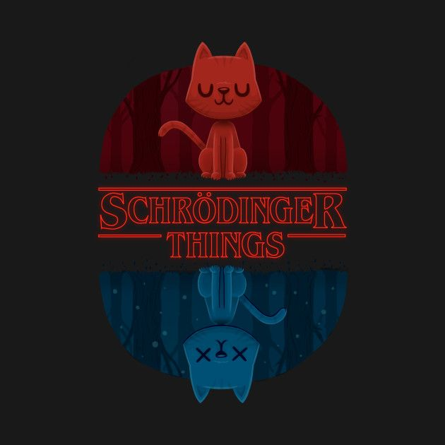

  

<pre>
    🎓 Physics Student @ Yildiz Technical University
    💻 Flutter Developer • Mobile App Dev
    🧪 Science • Technology • Open Source
    💙 Building beautiful, smooth apps
    🏀 Basketball • 🎸 Music • 🎮 Games • 🎨 Art • 🚗 Cars
</pre>
  

   

    

